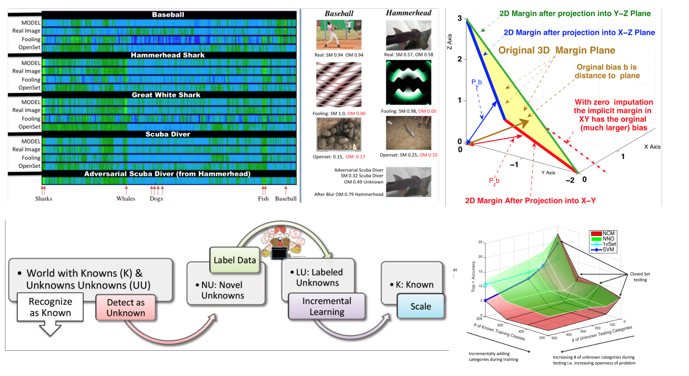

## Open World Recognition

[Open World Recognition](https://vast.uccs.edu/~abendale/papers/Bendale_PhD_Thesis.pdf) is a machine learning paradigm developed during my PhD to enable recognition systems to operate in environments where new concepts can appear over time. Unlike traditional closed-set learning, where every test example is assumed to belong to a known class, Open World Recognition allows a system to identify previously unseen concepts and progressively expand what it knows.

Our [CVPR 2015 paper, *Towards Open World Recognition*](https://arxiv.org/abs/1412.5687), formally introduced the Open World Recognition problem and defined the requirements for a system to recognize known classes, reject unknowns, and incrementally learn new categories. We also introduced the Nearest Non-Outlier (NNO) algorithm and an evaluation protocol for measuring recognition performance as the set of known classes grows over time. The work was presented as an [oral presentation at CVPR 2015](http://techtalks.tv/talks/towards-open-world-recognition/61585/).

In our [CVPR 2016 paper, *Towards Open Set Deep Networks*](https://arxiv.org/abs/1511.06233), we extended these ideas to deep neural networks through **OpenMax**. OpenMax introduced an explicit notion of an unknown class by modeling the activation patterns of known categories, allowing deep networks to reject inputs that fall outside their learned knowledge rather than forcing every input into a known class. I presented this work in a [spotlight talk at CVPR 2016](https://www.youtube.com/watch?v=41YrOiavhGc).

Since then, Open World Recognition has become an active area of research spanning open-set recognition, open-world object detection, segmentation, continual learning, novelty detection, and autonomous systems. The broader problem of learning and adapting in the presence of novelty has also been explored through programs such as [DARPA SAIL-ON (Science of Artificial Intelligence and Learning for Open-world Novelty)](https://www.darpa.mil/research/programs/science-artificial-intelligence-and-learning-for-open-world-novelty). A continuing [CVPR Open World Vision workshop series](https://vplow.github.io/vplow_6th.html) has brought together researchers working on these problems, and the original work has been followed by numerous papers extending open-world learning across computer vision, robotics, and modern AI systems.