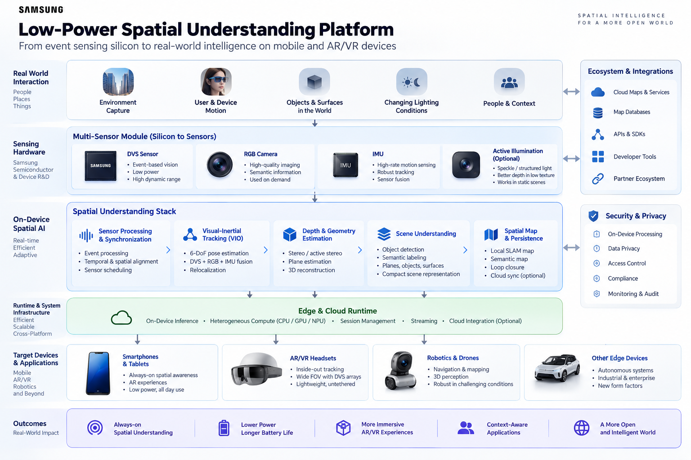
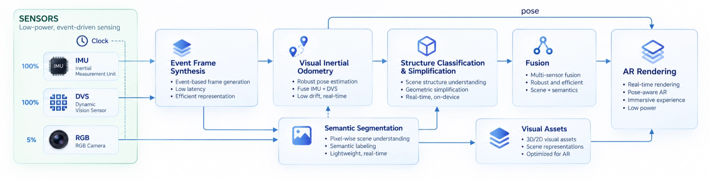
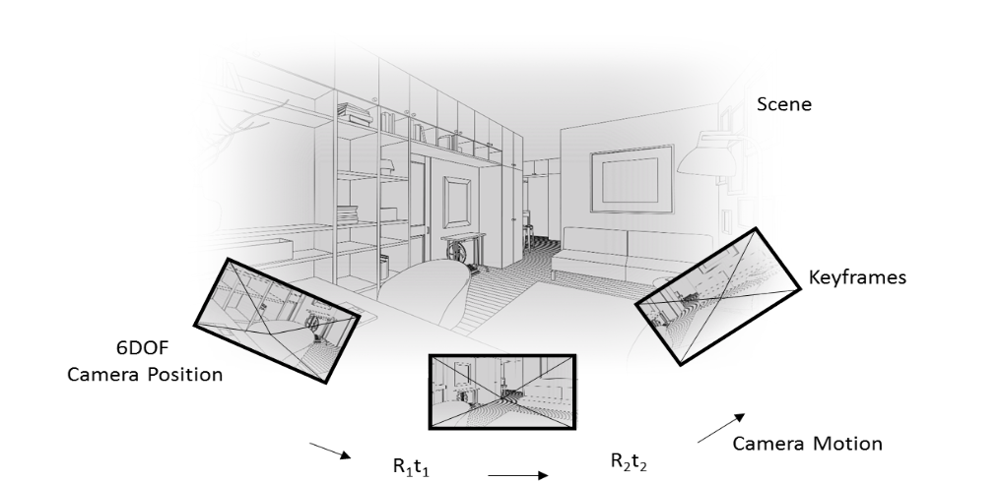
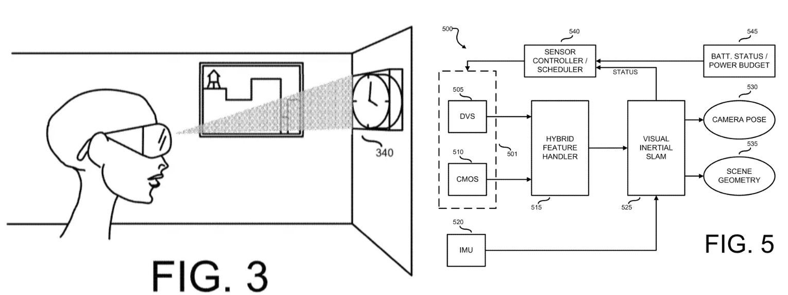

## Spatial Understanding for Mobile and AR/VR

At Samsung Electronics, we developed a low-power spatial understanding platform spanning hardware, event-based vision, visual-inertial odometry (VIO), depth and geometry estimation, semantic mapping, and persistent world maps. A central component of the platform was the Dynamic Vision Sensor (DVS), which provides low-power operation, microsecond-scale temporal resolution, and high dynamic range. Unlike a conventional camera that repeatedly captures complete image frames, a DVS pixel generates an event only when it observes a sufficient change in intensity.

### Hybrid DVS + RGB for Low-Power SLAM

We developed a hybrid DVS + RGB architecture where the low-power DVS performs much of the continuous tracking and the RGB camera is activated only when additional information is required. A Hybrid Feature Handler aligns DVS and RGB observations into a common representation. A sensor scheduler decides when the RGB camera should be active based on factors such as tracking confidence, number of available feature tracks, initialization state, remaining battery, and the device's power budget. Once the system is localized, the RGB camera can be switched off while DVS-based tracking continues. If confidence falls or tracking fails, RGB observations can assist with relocalization and recovery.

 The goal was not simply better SLAM accuracy. It was adaptive perception: spend sensing and compute power only when the environment or tracking state requires it. The perception stack was designed to work across form factors, including Samsung Galaxy phones, AR/VR headsets, stereo-camera systems, and ADAS systems.

 ### Depth and 3D Geometry

 Tracking tells the device where it is. Spatial understanding also requires knowing what the surrounding geometry looks like. For this, we developed an event-based active stereo system combining a synchronized pair of DVS cameras, an IMU, and a pulsed speckle-pattern projector. Because each DVS event carries a precise timestamp, the system could distinguish events generated naturally by the scene from events caused by projected illumination. Events could then be motion-compensated using the IMU, aggregated into event representations, and matched between the stereo cameras to estimate depth and scene geometry.

 ### Persistent Spatial Understanding

 A spatial computing device also needs to recognize places it has seen before. Our tracking architecture supported previously constructed 3D maps represented using keyframes, camera poses, and sparse geometry. These maps could be created offline using Structure from Motion (SfM) and reused later for initialization, tracking, and relocalization.

 This provides a natural bridge from local SLAM to persistent spatial maps: a device can continuously understand its immediate surroundings while also connecting that local perception to a larger, previously built representation of the world.

 ### Spatial Understanding for AR/VR Applications

 For AR/VR headsets, we extended the same low-power architecture to mono, stereo, and multi-stereo DVS configurations. Multiple cameras with overlapping fields of view improve feature persistence and provide wider spatial coverage, particularly during rapid head motion. Combined with RGB and IMU sensing, the architecture enables low-latency inside-out tracking and spatial mapping while operating within the tight power and weight constraints of wearable devices.

 ### Silicon to Spatial Understanding Stack

 The broader work was therefore not just about building an event camera or a SLAM algorithm. The underlying idea was straightforward: spatial computing should not require continuously running the most expensive sensors at full power. By designing sensing, algorithms, and spatial representations together, the system could selectively use the right sensor and computation for the current task. This made event-based vision useful not as an isolated camera technology, but as the foundation for a broader low-power perception and spatial understanding platform for phones, AR/VR devices, robotics, and other edge systems.