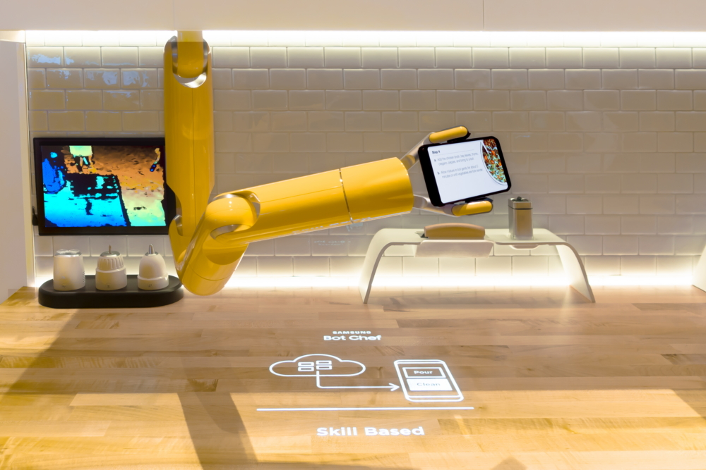
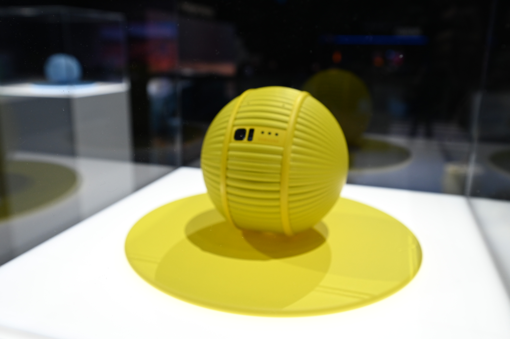

## SARAM & Ballie — Physical AI and Embodied Intelligence

Architected the **Physical AI and Embodied AI stack** for Samsung's SARAM (Bot Chef) robotic platform and Ballie companion robot, bringing together real-time perception, multimodal interaction, environment understanding, motion planning, and robot control. The work focused on building closed-loop **perception → planning → action** systems that could sense the physical world, reason about people and objects around them, and act safely in human environments.

### SARAM (Bot Chef) — Embodied AI for Robotic Manipulation

SARAM is Samsung's multi-purpose programmable robotic platform and powers **Samsung Bot Chef**, a six-degree-of-freedom collaborative robotic arm that works alongside people. Its Physical AI stack combines internal and external sensing, computer vision, **AI-based task and motion planning**, and real-time control to manipulate everyday objects and perform tasks such as pouring, stirring, cutting, and cleaning.

The system implements an embodied **sense → plan → act** loop in which sensor inputs are used to understand the robot and its surroundings, select appropriate actions, and continuously adapt execution as people and objects move around it. On top of the robotics stack, we develop an extensible **AI/ML skills framework** that represents manipulation behaviors as reusable task primitives. Skills can be invoked through voice, physical demonstration, or application controls, allowing higher-level tasks to be composed from learned and programmed behaviors.

SARAM is widely covered by media. [Samsung Technology Showcase — SARAM and Bot Chef](https://news.samsung.com/global/get-a-glimpse-of-the-next-generation-innovations-on-display-at-samsungs-technology-showcase), [Samsung Bot Chef and AI Skills Platform](https://news.samsung.com/global/the-samsung-club-des-chefs-kitchen-heats-up-with-ai-assistance-at-ifa-2019), [TechCrunch — Samsung Bot Chef at CES 2020](https://techcrunch.com/2020/01/07/samsungs-knife-wielding-robotic-chef-is-all-flash/)

### Ballie — Mobile Embodied AI for the Home

Ballie is a compact autonomous home robot that perceives its environment, understands and follows people, navigates dynamic indoor spaces, and interacts with users and connected devices. It is built around **on-device AI and edge inference**, delivering low-latency perception and interaction while keeping more personal data local to the device.

The robotics stack combines **on-device computer vision, person detection and tracking, environment understanding, autonomous navigation, multimodal interaction, and smart-home orchestration**. Efficient vision models running locally enable Ballie to continuously interpret its surroundings while operating within the compute and power constraints of a mobile robot. The perception and navigation systems translate this understanding into real-time movement, allowing the robot to follow users and respond to activity within the home. As a mobile AI agent, Ballie provides a physical interface to the smart home, observing activity in the home and coordinating with connected devices. It combines perception, context, local intelligence, mobility, and the ability to take actions in the physical environment rather than only respond through a screen.

Ballie is widely covered by media. [Samsung — Ballie at CES 2020](https://news.samsung.com/us/samsung-ballie-ces-2020/), [Samsung CES 2020 Keynote — Age of Experience](https://news.samsung.com/us/samsung-age-of-experience-keynote-ces-2020/), [TechCrunch — Meet Ballie, Samsung's Rolling Personal Assistant](https://techcrunch.com/2020/01/06/meet-ballie-samsungs-rolling-personal-assistant-that-does-stuff/), [VentureBeat — Samsung's Ballie and On-device AI](https://venturebeat.com/technology/samsungs-ballie-is-a-home-robot-designed-with-privacy-in-mind/)

SARAM/Bot Chef and Ballie were showcased at **CES 2020** as part of Samsung's broader vision for human-centered AI, intelligent robotics, edge computing, and connected spaces. 