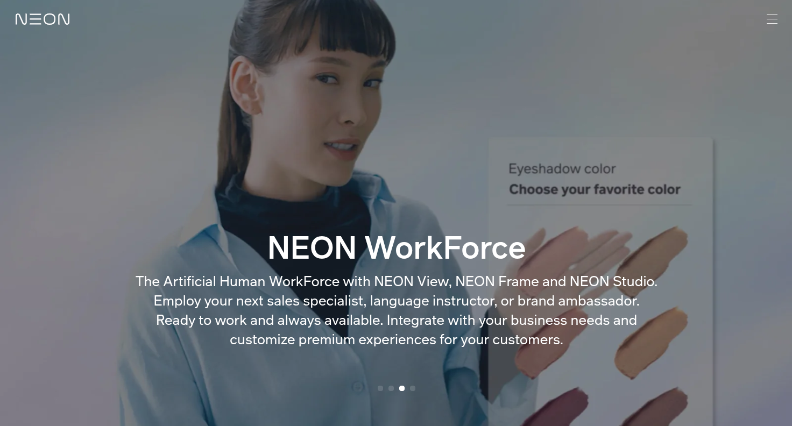
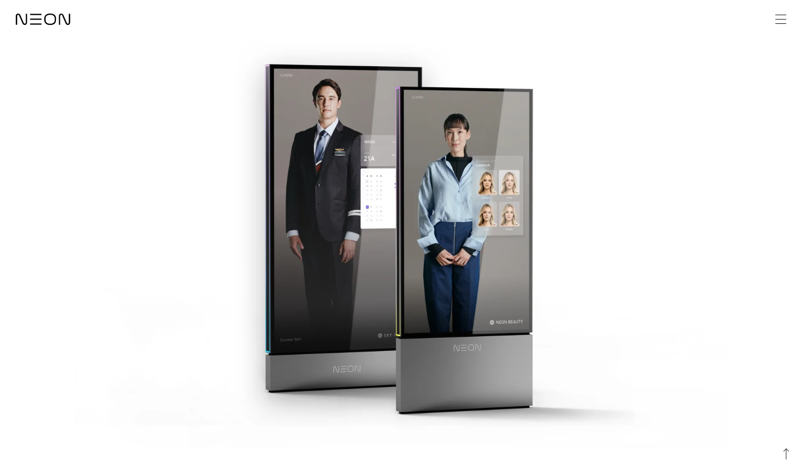
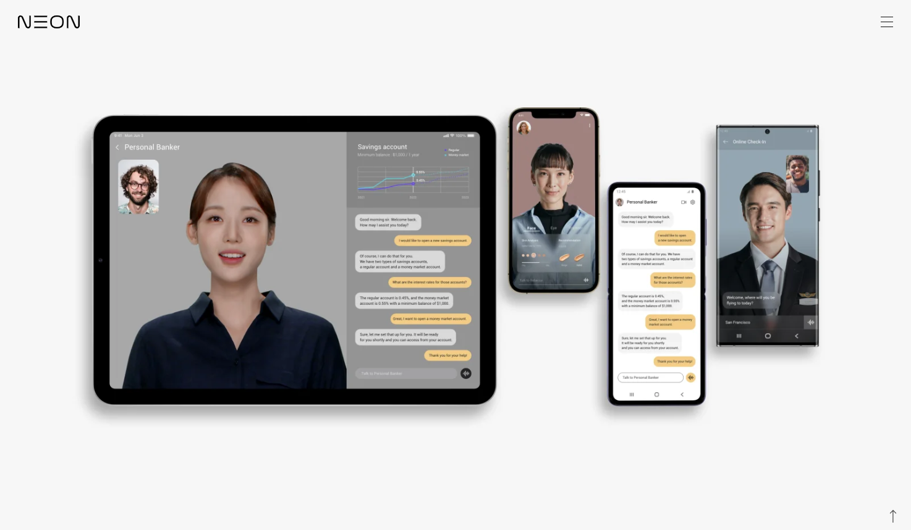

## NEON: Building Artificial Humans at Samsung STAR Labs

NEON is an Artificial Human platform developed at Samsung STAR Labs to generate a natural interface to AI. At its core is **CORE R3 — Reality, Realtime, Responsive**, which focuses on generating photorealistic digital humans and their behavior in real time, while **SPECTRA** provides the intelligence layer for learning, memory, emotion, and personalization.

### NEON WorkForce

NEON WorkForce brings Artificial Humans into enterprise experiences such as retail, banking, hospitality, education, and customer service. The idea is to combine domain-specific business intelligence with a natural, human-facing interface.

### NEON Frame

NEON Frame is a life-size immersive display designed to bring Artificial Humans into physical spaces. It combines a large-format display with cameras, microphones, audio, connectivity, and optional sensors to support interactive experiences in places such as stores, airports, hotels, and banks.

### NEON Studio

NEON Studio is a content-authoring platform for creating videos with Artificial Humans. Creators can work with scripts and control speech, expressions, gestures, behavior, appearance, and timing without repeatedly needing cameras, lights, or actors.

### NEON View

NEON View brings realtime Artificial Humans to phones, tablets, web applications, and connected displays. It is designed as an API-driven layer that enterprises can integrate with their own applications, domain knowledge, and backend services.

### Technology Behind NEON

Building an Artificial Human requires much more than generating a realistic face. The platform combines several areas of AI and systems engineering:

- **Neural rendering and computational reality** to generate photorealistic human appearance while preserving identity and visual consistency.
- **Behavioral and multimodal models** to coordinate facial expressions, gaze, head movement, body motion, gestures, speech, and conversational state.
- **Speech and language systems** for understanding user input, generating responses, and synchronizing voice with facial and body behavior.
- **Realtime inference and rendering** so the Artificial Human continues to listen, react, move, and respond naturally during live interaction.
- **Memory, personality, and personalization** through the broader SPECTRA vision, allowing interactions to develop continuity over time.
- **Enterprise APIs and experiences** that separate the Artificial Human interface from the business logic behind it, allowing different industries to connect their own services and knowledge.

The broader goal of NEON is to explore what happens when intelligent systems move beyond text and voice interfaces and begin to communicate through the richer signals people naturally use with one another — speech, expression, gaze, gesture, behavior, and presence.